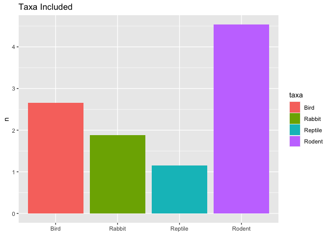
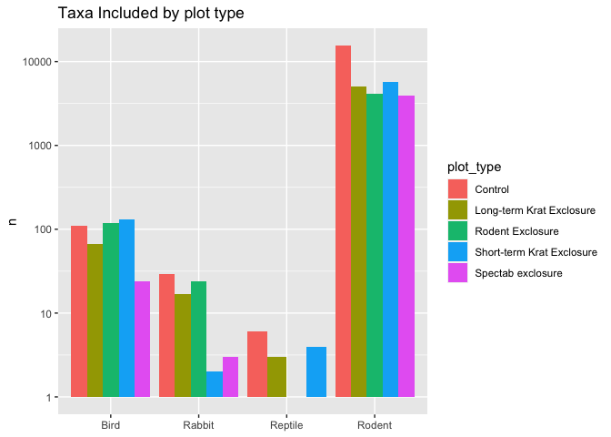
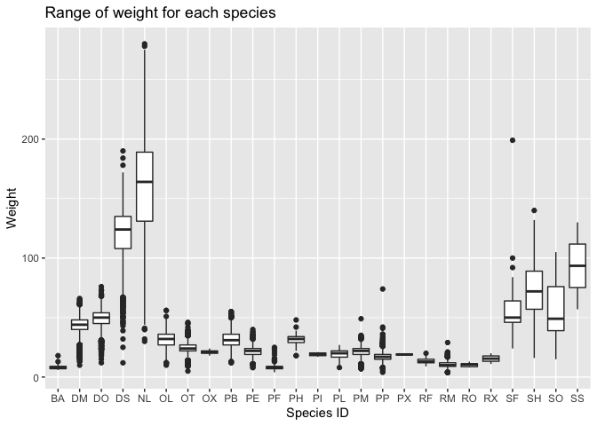
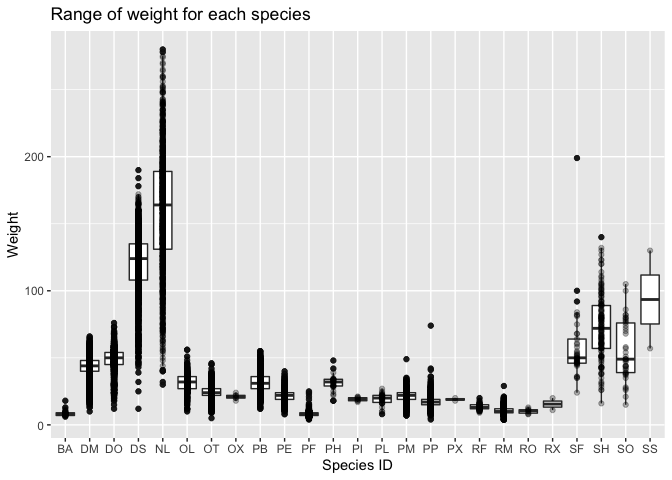
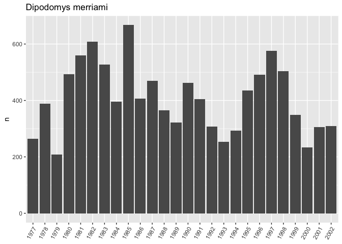
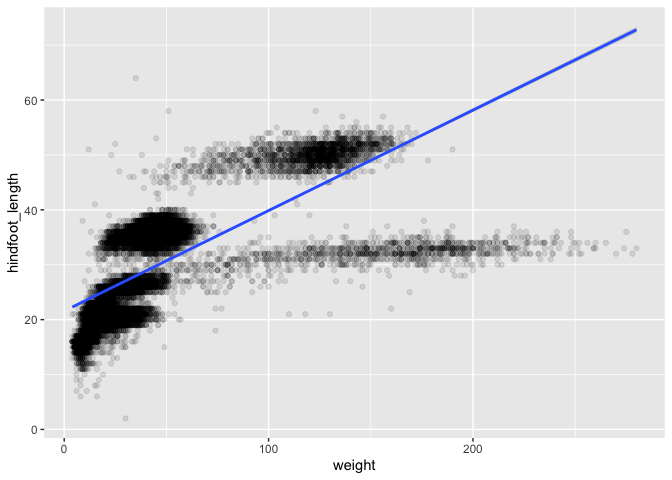
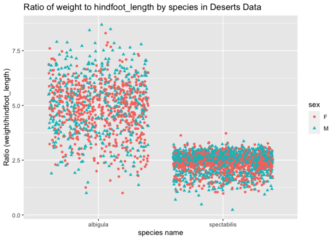
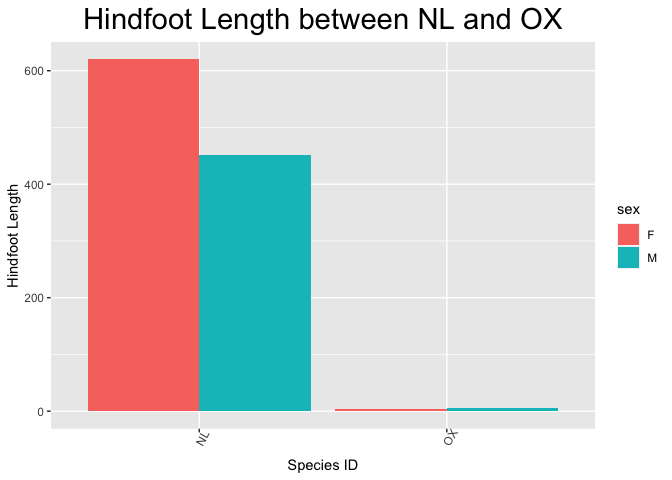

## Instructions
Answer the following questions and complete the exercises in RMarkdown. Please embed all of your code and push your final work to your repository. Your final lab report should be organized, clean, and run free from errors. Remember, you must remove the `#` for the included code chunks to run. Be sure to add your name to the author header above. For any included plots, make sure they are clearly labeled. You are free to use any plot type that you feel best communicates the results of your analysis.  

Make sure to use the formatting conventions of RMarkdown to make your report neat and clean!  

## Load the libraries

```r
library(tidyverse)
library(janitor)
library(here)
library(naniar)
```

## Desert Ecology
For this assignment, we are going to use a modified data set on [desert ecology](http://esapubs.org/archive/ecol/E090/118/). The data are from: S. K. Morgan Ernest, Thomas J. Valone, and James H. Brown. 2009. Long-term monitoring and experimental manipulation of a Chihuahuan Desert ecosystem near Portal, Arizona, USA. Ecology 90:1708.

```r
deserts <- read_csv(here("lab10", "data", "surveys_complete.csv"))
```

```
## Rows: 34786 Columns: 13
## ── Column specification ────────────────────────────────────────────────────────
## Delimiter: ","
## chr (6): species_id, sex, genus, species, taxa, plot_type
## dbl (7): record_id, month, day, year, plot_id, hindfoot_length, weight
## 
## ℹ Use `spec()` to retrieve the full column specification for this data.
## ℹ Specify the column types or set `show_col_types = FALSE` to quiet this message.
```

1. Use the function(s) of your choice to get an idea of its structure, including how NA's are treated. Are the data tidy?  

```r
glimpse(deserts)
```

```
## Rows: 34,786
## Columns: 13
## $ record_id       <dbl> 1, 2, 3, 4, 5, 6, 7, 8, 9, 10, 11, 12, 13, 14, 15, 16,…
## $ month           <dbl> 7, 7, 7, 7, 7, 7, 7, 7, 7, 7, 7, 7, 7, 7, 7, 7, 7, 7, …
## $ day             <dbl> 16, 16, 16, 16, 16, 16, 16, 16, 16, 16, 16, 16, 16, 16…
## $ year            <dbl> 1977, 1977, 1977, 1977, 1977, 1977, 1977, 1977, 1977, …
## $ plot_id         <dbl> 2, 3, 2, 7, 3, 1, 2, 1, 1, 6, 5, 7, 3, 8, 6, 4, 3, 2, …
## $ species_id      <chr> "NL", "NL", "DM", "DM", "DM", "PF", "PE", "DM", "DM", …
## $ sex             <chr> "M", "M", "F", "M", "M", "M", "F", "M", "F", "F", "F",…
## $ hindfoot_length <dbl> 32, 33, 37, 36, 35, 14, NA, 37, 34, 20, 53, 38, 35, NA…
## $ weight          <dbl> NA, NA, NA, NA, NA, NA, NA, NA, NA, NA, NA, NA, NA, NA…
## $ genus           <chr> "Neotoma", "Neotoma", "Dipodomys", "Dipodomys", "Dipod…
## $ species         <chr> "albigula", "albigula", "merriami", "merriami", "merri…
## $ taxa            <chr> "Rodent", "Rodent", "Rodent", "Rodent", "Rodent", "Rod…
## $ plot_type       <chr> "Control", "Long-term Krat Exclosure", "Control", "Rod…
```


```r
naniar::miss_var_summary(deserts)
```

```
## # A tibble: 13 × 3
##    variable        n_miss pct_miss
##    <chr>            <int>    <dbl>
##  1 hindfoot_length   3348     9.62
##  2 weight            2503     7.20
##  3 sex               1748     5.03
##  4 record_id            0     0   
##  5 month                0     0   
##  6 day                  0     0   
##  7 year                 0     0   
##  8 plot_id              0     0   
##  9 species_id           0     0   
## 10 genus                0     0   
## 11 species              0     0   
## 12 taxa                 0     0   
## 13 plot_type            0     0
```

2. How many genera and species are represented in the data? What are the total number of observations? Which species is most/ least frequently sampled in the study?

```r
deserts %>% 
  summarise(n_genera = n_distinct(genus),
            n_species = n_distinct(species),
            n = n())
```

```
## # A tibble: 1 × 3
##   n_genera n_species     n
##      <int>     <int> <int>
## 1       26        40 34786
```


```r
deserts %>% 
  tabyl(species) %>% 
  as.data.frame() %>% 
  arrange(desc(n))
```

```
##            species     n      percent
## 1         merriami 10596 3.046053e-01
## 2     penicillatus  3123 8.977750e-02
## 3            ordii  3027 8.701777e-02
## 4          baileyi  2891 8.310815e-02
## 5        megalotis  2609 7.500144e-02
## 6      spectabilis  2504 7.198298e-02
## 7         torridus  2249 6.465245e-02
## 8           flavus  1597 4.590927e-02
## 9         eremicus  1299 3.734261e-02
## 10        albigula  1252 3.599149e-02
## 11     leucogaster  1006 2.891968e-02
## 12     maniculatus   899 2.584373e-02
## 13         harrisi   437 1.256253e-02
## 14       bilineata   303 8.710401e-03
## 15       spilosoma   248 7.129305e-03
## 16        hispidus   179 5.145748e-03
## 17             sp.    86 2.472259e-03
## 18       audubonii    75 2.156040e-03
## 19      fulvescens    75 2.156040e-03
## 20 brunneicapillus    50 1.437360e-03
## 21         taylori    46 1.322371e-03
## 22     fulviventer    43 1.236129e-03
## 23    ochrognathus    43 1.236129e-03
## 24       chlorurus    39 1.121141e-03
## 25        leucopus    36 1.034899e-03
## 26        squamata    16 4.599552e-04
## 27     melanocorys    13 3.737136e-04
## 28     intermedius     9 2.587248e-04
## 29       gramineus     8 2.299776e-04
## 30        montanus     8 2.299776e-04
## 31          fuscus     5 1.437360e-04
## 32       undulatus     5 1.437360e-04
## 33      leucophrys     2 5.749439e-05
## 34      savannarum     2 5.749439e-05
## 35          clarki     1 2.874720e-05
## 36      scutalatus     1 2.874720e-05
## 37    tereticaudus     1 2.874720e-05
## 38          tigris     1 2.874720e-05
## 39       uniparens     1 2.874720e-05
## 40         viridis     1 2.874720e-05
```

3. What is the proportion of taxa included in this study? Show a table and plot that reflects this count.

```r
deserts %>% 
  count(taxa)
```

```
## # A tibble: 4 × 2
##   taxa        n
##   <chr>   <int>
## 1 Bird      450
## 2 Rabbit     75
## 3 Reptile    14
## 4 Rodent  34247
```


```r
deserts %>% 
  count(taxa) %>% 
  ggplot(aes(x=taxa, y=log10(n), fill=taxa)) + geom_col()+
  theme(axis.text.x = element_text(hjust = 0.5)) +
  labs(title = "Taxa Included",
       x = NULL,
       y= "n")
```

<!-- -->

4. For the taxa included in the study, use the fill option to show the proportion of individuals sampled by `plot_type.`

```r
deserts %>% 
  ggplot(aes(x=taxa, fill=plot_type)) + geom_bar(position="dodge") +
  scale_y_log10()+
  theme(axis.text.x = element_text(hjust = 0.5)) +
  labs(title = "Taxa Included by plot type",
       x = NULL,
       y= "n")
```

<!-- -->

5. What is the range of weight for each species included in the study? Remove any observations of weight that are NA so they do not show up in the plot.

```r
deserts %>% 
  filter(weight!="NA") %>% 
  ggplot(aes(x=species_id, y=weight)) +
  geom_boxplot()+
  labs(title = "Range of weight for each species",
       x = "Species ID",
       y = "Weight")
```

<!-- -->

6. Add another layer to your answer from #4 (it works with #5 code) using `geom_point` to get an idea of how many measurements were taken for each species.

```r
deserts %>% 
  filter(weight!="NA") %>% 
  ggplot(aes(x=species_id, y=weight)) +
  geom_boxplot()+
  geom_point(alpha=0.3)+
  labs(title = "Range of weight for each species",
       x = "Species ID",
       y = "Weight")
```

<!-- -->

7. [Dipodomys merriami](https://en.wikipedia.org/wiki/Merriam's_kangaroo_rat) is the most frequently sampled animal in the study. How have the number of observations of this species changed over the years included in the study?

```r
deserts %>% 
  filter(species_id=="DM") %>% 
  group_by(year) %>% 
  summarize(n_samples=n()) %>% 
  ggplot(aes(x=as.factor(year), y=n_samples)) + geom_col()+
  theme(axis.text.x = element_text(angle = 60, hjust = 1)) +
  labs(title = "Dipodomys merriami",
       x = NULL,
       y= "n")
```

<!-- -->

8. What is the relationship between `weight` and `hindfoot` length? Consider whether or not over plotting is an issue.

```r
deserts %>%
  ggplot(aes(x=weight, y=hindfoot_length))+
  geom_point(na.rm=T, alpha=0.1)+
  geom_smooth(method = "lm",na.rm=T)
```

```
## `geom_smooth()` using formula 'y ~ x'
```

<!-- -->

9. Which two species have, on average, the highest weight? Once you have identified them, make a new column that is a ratio of `weight` to `hindfoot_length`. Make a plot that shows the range of this new ratio and fill by sex.
Albigula and spectabilis have the average highest height 

```r
deserts %>%
  filter(weight!="NA") %>%
  group_by(species) %>% 
  summarise(mean_weight = mean(weight, na.rm = T)) %>% 
  arrange(desc(mean_weight))
```

```
## # A tibble: 22 × 2
##    species      mean_weight
##    <chr>              <dbl>
##  1 albigula           159. 
##  2 spectabilis        120. 
##  3 spilosoma           93.5
##  4 hispidus            65.6
##  5 fulviventer         58.9
##  6 ochrognathus        55.4
##  7 ordii               48.9
##  8 merriami            43.2
##  9 baileyi             31.7
## 10 leucogaster         31.6
## # … with 12 more rows
```

```r
deserts_2 <- deserts %>%
  filter(weight!="NA" & hindfoot_length!="NA") %>%
  mutate(w_h_ratio = weight/hindfoot_length)
deserts_2
```

```
## # A tibble: 30,738 × 14
##    record_id month   day  year plot_id species_id sex   hindfoot_length weight
##        <dbl> <dbl> <dbl> <dbl>   <dbl> <chr>      <chr>           <dbl>  <dbl>
##  1        63     8    19  1977       3 DM         M                  35     40
##  2        64     8    19  1977       7 DM         M                  37     48
##  3        65     8    19  1977       4 DM         F                  34     29
##  4        66     8    19  1977       4 DM         F                  35     46
##  5        67     8    19  1977       7 DM         M                  35     36
##  6        68     8    19  1977       8 DO         F                  32     52
##  7        69     8    19  1977       2 PF         M                  15      8
##  8        70     8    19  1977       3 OX         F                  21     22
##  9        71     8    19  1977       7 DM         F                  36     35
## 10        74     8    19  1977       8 PF         M                  12      7
## # … with 30,728 more rows, and 5 more variables: genus <chr>, species <chr>,
## #   taxa <chr>, plot_type <chr>, w_h_ratio <dbl>
```


```r
deserts_2 %>% 
  filter(species=="albigula"|species=="spectabilis") %>% 
  filter(sex!="NA") %>% 
  ggplot(aes(x = species, y = w_h_ratio, color = sex, shape = sex)) + 
  geom_jitter() +
  labs(title = "Ratio of weight to hindfoot_length by species in Deserts Data",
       x = "species name",
       y = "Ratio (weight/hindfoot_length)")
```

<!-- -->

10. Make one plot of your choice! Make sure to include at least two of the aesthetics options you have learned.

```r
deserts %>% 
  filter(species_id=="OX" | species_id=="NL") %>% 
  filter(hindfoot_length!="NA" & sex!="NA") %>% 
  mutate(ratio=hindfoot_length) %>% 
  select(species_id, sex, hindfoot_length, ratio) %>% 
  ggplot(aes(x=species_id, fill=sex)) + geom_bar(position="dodge")+
  theme(axis.text.x = element_text(angle = 60, hjust = 0.5)) +  
  theme(plot.title = element_text(size = rel(2), hjust = 0.5)) +
  labs(title = "Hindfoot Length between NL and OX",
       x = "Species ID",
       y = "Hindfoot Length")
```

<!-- -->

## Push your final code to GitHub!
Please be sure that you check the `keep md` file in the knit preferences. 
